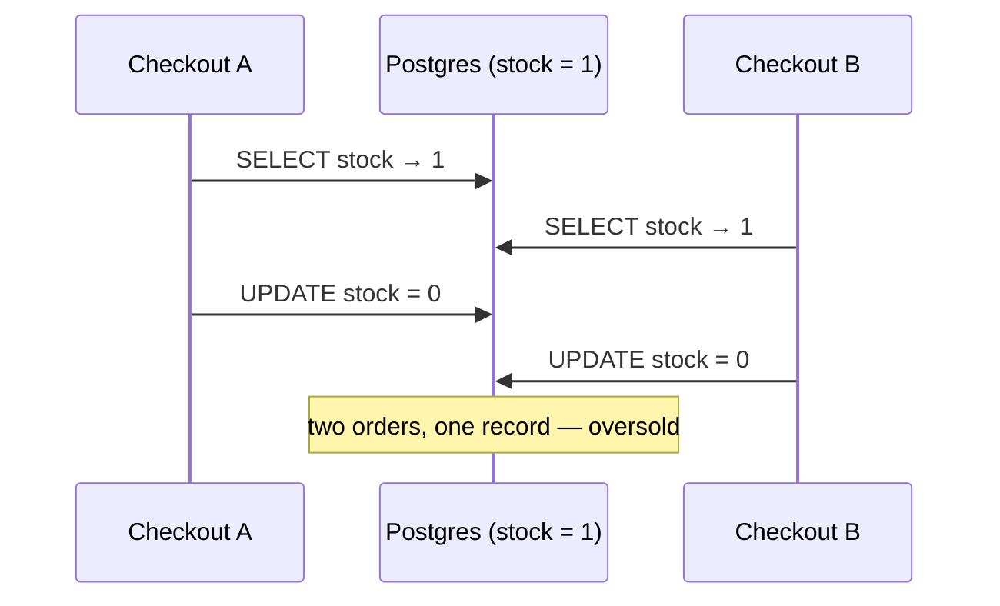

# Checkout & Orders

- **Status:** Draft — decisions marked ⚖️ are open
- **Date:** 2026-09-14
- **Scope:** turning a cart into an order, with stock that can't oversell

## 1. Why this feature

It's the first feature where correctness depends on more than one request
at a time. Concepts it exercises:

| Concept                           | Where it appears                                        |
| --------------------------------- | ------------------------------------------------------- |
| Snapshotting                      | `OrderItem` freezes price, title and artist at purchase |
| Transactions / atomicity          | order + lines + stock + cart cleared as one unit        |
| Concurrency control               | two buyers, one copy left                               |
| Lock ordering / deadlocks         | two checkouts touching the same products                |
| Referential integrity for history | order lines must survive a product delete               |
| API error contracts               | telling the client _which_ line is short                |

## 2. Where we are today

Facts from the current code, which shape the design:

- **The cart never checks stock.** `CartService.addItem` upserts a line
  without looking at `Product.stock`, and quantities are capped at 99 only
  by `quantitySchema`. So checkout is the **one authoritative stock check**.
- **The cart stores no prices.** Totals are computed from the live product on
  every read (`CartService.toContract`). The shared contract already says a
  frozen price "belongs at checkout, on the order".
- **Products are hard-deleted** (`ProductsService.remove` →
  `prisma.product.delete`), and `CartItem` cascades. Fine for carts, wrong for
  orders.
- **Prisma 7 + `@prisma/adapter-pg`** against Postgres. Interactive
  transactions (`prisma.$transaction(async (tx) => …)`) are available.
- **No test database.** One `DATABASE_URL`; only the scaffold e2e spec exists.

## 3. Goals and non-goals

**Goals (this iteration)**

1. `POST /orders` converts the signed-in user's cart into an order.
2. Stock never goes below zero, under any number of concurrent checkouts.
3. An order's contents and prices never change after it's placed.
4. Customers can list and view their own orders.

**Non-goals (later steps, each its own doc)**

- Idempotency keys (double-submit / retried requests)
- Payments and the paid → shipped lifecycle
- Cancellation that restocks
- Stock reservations with expiry (hold items while paying)
- Shipping, tax, addresses

## 4. Data model

```prisma
enum OrderStatus {
  pending    // placed, not yet paid — the only state this iteration creates
  paid
  shipped
  cancelled
}

model Order {
  id            String      @id @default(uuid())
  userId        String
  user          User        @relation(fields: [userId], references: [id], onDelete: Restrict)

  status        OrderStatus @default(pending)
  /// Snapshot: sum of the lines at purchase. Stored, not derived — unlike the
  /// cart, an order's total must not move if a line's data were ever corrected.
  subtotalCents Int
  currency      String

  items         OrderItem[]

  createdAt     DateTime    @default(now())
  updatedAt     DateTime    @updatedAt

  /// "My orders, newest first" — also the cursor-pagination order.
  @@index([userId, createdAt(sort: Desc)])
}

model OrderItem {
  id             String   @id @default(uuid())
  orderId        String
  order          Order    @relation(fields: [orderId], references: [id], onDelete: Cascade)

  /// Nullable: kept for linking back while the product exists, nulled if it's
  /// deleted. The snapshot below is what the order actually renders from.
  productId      String?
  product        Product? @relation(fields: [productId], references: [id], onDelete: SetNull)

  quantity       Int
  /// Snapshot at purchase — never read from Product after creation.
  unitPriceCents Int
  title          String
  artist         String
  imageUrl       String?

  @@index([orderId])
}
```

`Product` gains `orderItems OrderItem[]`; `User` gains `orders Order[]`.

### Why snapshot, and how it differs from `CartItem`

|                 | `CartItem`                        | `OrderItem`                             |
| --------------- | --------------------------------- | --------------------------------------- |
| Represents      | an intention ("I might buy this") | a fact ("I bought this at this price")  |
| Price           | live, read from `Product`         | frozen `unitPriceCents`                 |
| Product deleted | line disappears (`Cascade`)       | line survives (`SetNull` + snapshot)    |
| Uniqueness      | one line per product (`@@unique`) | not needed — written once, never merged |

### ⚖️ Decision: what happens to order lines when a product is deleted

| Option                              | Effect                                                | Cost                                               |
| ----------------------------------- | ----------------------------------------------------- | -------------------------------------------------- |
| `Restrict`                          | a product that was ever sold can't be deleted         | admin delete breaks for most of the catalogue      |
| **`SetNull` + snapshot** (proposed) | delete still works; history renders from the snapshot | order line can't link to the product page any more |
| Soft delete (`archivedAt`)          | nothing is ever really deleted                        | every product query must filter archived rows      |

Proposed: **`SetNull`** now. It keeps the admin flow working and the snapshot
makes history independent of the product. Soft delete is the better long-term
answer, but it changes every product read and deserves its own change.

`Order.userId` uses `Restrict`: financial records shouldn't vanish because a
user row did. There's no user deletion flow yet, so this costs nothing today.

### Defence in depth: a database CHECK

```sql
ALTER TABLE "Product" ADD CONSTRAINT "Product_stock_non_negative" CHECK (stock >= 0);
```

Prisma's schema language can't express CHECK constraints, so this goes into
the migration SQL by hand (`prisma migrate dev --create-only`, edit, apply).
The application logic should make it unreachable. The constraint guarantees
that a bug, a script or a manual query can't create negative stock either.

## 5. API

All routes require a session, and every query is scoped by `userId` —
same rule as the cart.

| Route             | Purpose                              | Success                            | Errors                                                           |
| ----------------- | ------------------------------------ | ---------------------------------- | ---------------------------------------------------------------- |
| `POST /orders`    | place an order from the current cart | `201` + `Order`                    | `409 CART_EMPTY`, `409 INSUFFICIENT_STOCK`, `409 MIXED_CURRENCY` |
| `GET /orders`     | the user's orders, newest first      | `200` + `Connection<OrderSummary>` | —                                                                |
| `GET /orders/:id` | one order with its lines             | `200` + `Order`                    | `404` (including someone else's order)                           |

**No request body on `POST /orders`.** The server reads the cart itself. If
the client sent the lines, the server would have to re-validate every one
anyway, and the cart the user saw and the order created could disagree.

**Someone else's order returns `404`, not `403`.** A `403` confirms the id
exists.

**`GET /orders` is cursor-paginated**, reusing `Connection<T>` / `PageArgs`
from `@vinyl-order/shared`, the same as the catalogue.

### Error contract for a short line

```json
{
  "statusCode": 409,
  "code": "INSUFFICIENT_STOCK",
  "message": "Some records no longer have enough stock.",
  "items": [{ "productId": "…", "title": "American Idiot", "requested": 2, "available": 1 }]
}
```

`available` is read after the transaction rolls back and is informational
only; it may already be stale. The web shows the message, refetches the cart
and lets the user adjust.

**Currency.** The storefront assumes one currency (the cart page reads
`items[0].product.currency`). Checkout enforces that assumption: all lines
must share a currency, otherwise `409 MIXED_CURRENCY`. That's cheaper than
building multi-currency totals nobody needs yet.

### Shared contracts (`packages/shared/src/order.ts`)

Zod schemas following the `cart.ts` pattern: `orderStatusSchema`,
`orderItemSchema`, `orderSchema`, `orderSummarySchema` (no lines, for the
list), plus the error payload type for `INSUFFICIENT_STOCK`.

## 6. Checkout algorithm

One interactive transaction:

```
1. Load the cart lines (with products) for userId.
   - No lines            → throw CART_EMPTY
   - Currencies differ   → throw MIXED_CURRENCY
2. Sort lines by productId.                                  ← lock ordering (§7.3)
3. For each line:
     count = UPDATE Product SET stock = stock - qty
             WHERE id = productId AND stock >= qty           ← the stock guard (§7)
     count = 0 → record as short
4. Any short lines → throw INSUFFICIENT_STOCK (rolls back every decrement)
5. Create Order + OrderItems, snapshotting price/title/artist/imageUrl
   from the product rows loaded in step 1.
6. Delete the cart's lines.
7. Commit → return the order.
```

In Prisma, step 3 is:

```ts
const { count } = await tx.product.updateMany({
  where: { id: line.productId, stock: { gte: line.quantity } },
  data: { stock: { decrement: line.quantity } },
});
```

`updateMany` rather than `update` because it returns a `count` instead of
throwing when the `WHERE` matches nothing. That makes "not enough stock" a
value to check, not an exception to catch.

Step 3 checks **every** line before failing, so the error can list all
short records at once instead of making the user fix them one per attempt.

**Nothing slow inside the transaction.** No HTTP calls, no payment provider,
no email. The transaction holds row locks on every product it decremented,
and anything waiting on those rows waits for us. Payment will happen
_after_ commit, against a `pending` order (a later doc).

### Price consistency

Prices are snapshotted from the rows read in step 1. If an admin changes a
price between the moment the customer looked at the cart and checkout, the
order uses the price at checkout. For a learning shop that's acceptable. A
real one would compare against the displayed subtotal and ask the user to
confirm on mismatch (a `409 PRICE_CHANGED`). Noted, not built.

## 7. Concurrency: selling the last copy exactly once

### 7.1 The race



Read-then-write with a check in application code is the bug. Both reads
happen before either write.

### 7.2 ⚖️ Decision: how to guard stock

| Option                               | How                                                                               | Pros                                                                 | Cons                                                                |
| ------------------------------------ | --------------------------------------------------------------------------------- | -------------------------------------------------------------------- | ------------------------------------------------------------------- |
| **A. Conditional update** (proposed) | `UPDATE … SET stock = stock - n WHERE id = ? AND stock >= n`, check rows affected | one statement; no raw SQL; no retry loop; works at default isolation | only fits "decrement if enough", not arbitrary multi-row rules      |
| B. Pessimistic lock                  | `SELECT … FOR UPDATE`, check in code, then `UPDATE`                               | check logic can be anything                                          | needs `$queryRaw` in Prisma; two round trips while holding the lock |
| C. Optimistic version                | `version` column; `UPDATE … WHERE version = ?`; retry on 0 rows                   | no locks held between read and write                                 | retry loop; under contention (a hot release) most attempts retry    |
| D. `SERIALIZABLE` isolation          | let Postgres detect the anomaly                                                   | correct for any logic                                                | must retry on serialization failures; more aborts under load        |
| E. Redis counter / queue             | decrement in Redis, persist async                                                 | handles flash-sale traffic                                           | two sources of truth; Month 2 material                              |

**Proposed: A.** The rule is exactly "take n if at least n remain", which
a single conditional `UPDATE` expresses completely.

**Why A is safe at Postgres's default `READ COMMITTED`:** an `UPDATE` locks
the row it modifies. A second `UPDATE` on the same row waits for the first
transaction to finish. When it resumes, Postgres **re-checks the `WHERE`
clause against the newly committed row**. Checkout A commits `stock = 0`, so
B's `stock >= 1` is now false and B updates 0 rows. No read in application
code sits between the check and the write, so there's no gap to race
through.

When to reach for the others: **B** if the check needs data from several
tables. **C** for long user-facing edits where holding a lock is impossible
(e.g. editing a product form). **D** when the invariant spans rows in ways a
single statement can't express. **E** when the database itself is the
bottleneck.

### 7.3 Deadlocks, and why lines are sorted

Checkout A's cart holds [X, Y]; checkout B's holds [Y, X]. A locks X and
waits for Y; B locks Y and waits for X. Neither can proceed, and Postgres
aborts one with a deadlock error.

Sorting lines by `productId` before decrementing means every checkout
acquires locks in the same global order, so the cycle can't form. It's a
one-line fix that's easy to forget and hard to debug later.

### 7.4 Two tabs, same user

The same user checking out from two tabs at once: the first transaction
locks the product rows and empties the cart. The second waits on those rows,
passes or fails the stock guard on its own merits, and could still create a
**second order from cart lines it read before the first commit**. Stock is
never oversold, but the user gets a duplicate order.

That's exactly the problem idempotency keys solve, and it's why they're
the next doc after this one. A cheap partial guard for now: in step 6, if
`deleteMany` on the cart removes fewer lines than step 1 loaded, another
checkout consumed the cart first → throw and roll back.

## 8. Web

- **Cart page:** "Place order" button → `useCreateOrder` mutation.
  - `201` → navigate to `/orders/[id]`.
  - `409 INSUFFICIENT_STOCK` → show which lines are short, refetch the cart.
  - Button disabled while pending (UX only — the server is the real guard).
- **`/orders/[id]`:** confirmation / detail, rendered from the snapshot.
- **`/account/orders`:** the order list, cursor-paginated.

**Cache (React Query):**

- Order keys live under `sessionQueryKey` (`['session', 'orders', …]`), so a
  change of user clears them on login (added in PR #7).
- On success: set the cart query to empty (the server just cleared it),
  invalidate `['products']` (stock changed), and seed the new order's detail
  query with the response.

## 9. Testing

**The one test that matters — concurrent checkout (e2e, real Postgres):**

```
Given a product with stock = 1
And 10 users, each with that product (qty 1) in their cart
When all 10 POST /orders at the same time (Promise.all)
Then exactly 1 response is 201 and 9 are 409 INSUFFICIENT_STOCK
And product stock is 0
And exactly 1 Order exists for that product
```

Run it several times. A race that passes once proves little. Mocked Prisma
can't test this: the guarantee comes from Postgres row locking, so the test
needs a real database.

Also:

- a deadlock test: two users with carts [X, Y] and [Y, X], concurrent checkout
  → both succeed (enough stock), no deadlock error
- empty cart → `409 CART_EMPTY`
- price snapshot: place an order, change the product price, the order total
  is unchanged
- product deleted after ordering → order still renders, `productId` null
- `GET /orders/:id` for another user's order → `404`

**⚖️ Test database.** There's one `DATABASE_URL` today. Proposed: a second
database (`vinyl_test`) in the same docker-compose Postgres, a
`.env.test`, and `prisma migrate reset --force` before the e2e run. Tests
must never touch the dev database.

## 10. Implementation order

1. Migration: `Order`, `OrderItem`, `OrderStatus`, stock CHECK constraint.
2. Shared zod contracts (`order.ts`).
3. `OrdersService.checkout` + the concurrency e2e test, **before** the web.
4. `GET /orders`, `GET /orders/:id`.
5. Web: Place order button, confirmation page, account order list.

## 11. Open questions

1. ⚖️ Stock guard — conditional update (A) as proposed?
2. ⚖️ Product delete — `SetNull` + snapshot as proposed, or go straight to
   soft delete?
3. ⚖️ Test database — separate `vinyl_test` database as proposed?
4. Should the cart warn about low stock _before_ checkout (e.g. cap the
   quantity stepper at `stock`)? It's UX only; checkout stays the real check.
5. Human-readable order numbers (`VO-2026-000123`) or UUIDs only for now?

## 12. Interview talking points

- "Why not check stock, then update?" → the read-then-write race (§7.1).
- "Why is a conditional UPDATE safe without SERIALIZABLE?" → row lock plus
  re-evaluation of the `WHERE` clause after waiting (§7.2).
- "What if two carts contain the same items?" → consistent lock ordering (§7.3).
- "Why store the price on the order?" → orders are facts, carts are
  intentions (§4).
- "What about double-clicks?" → the UI guard is cosmetic; idempotency keys
  are the real fix (§7.4, next doc).
